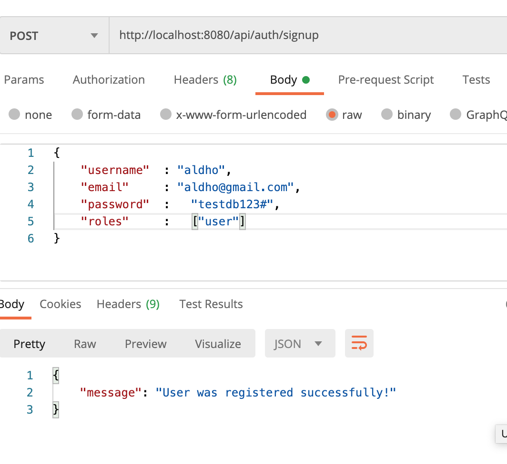
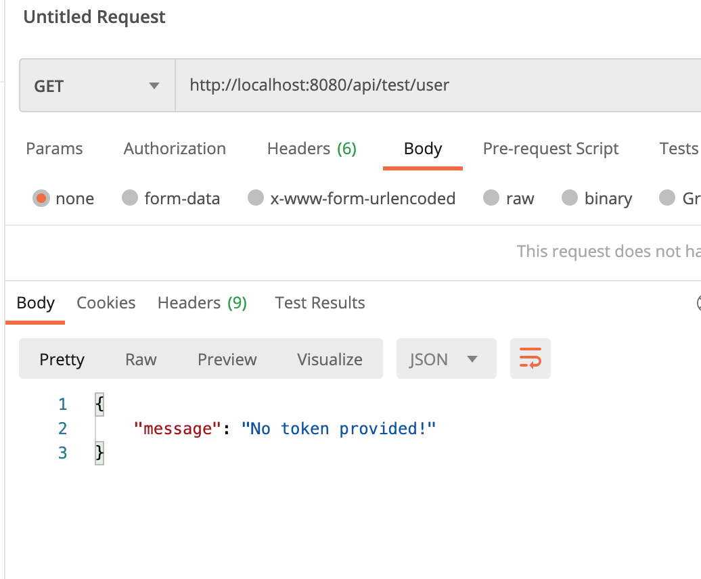
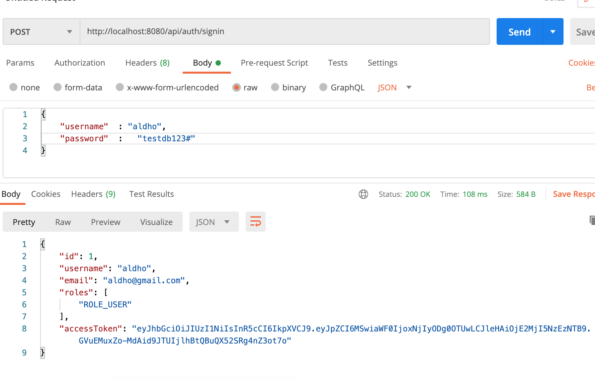
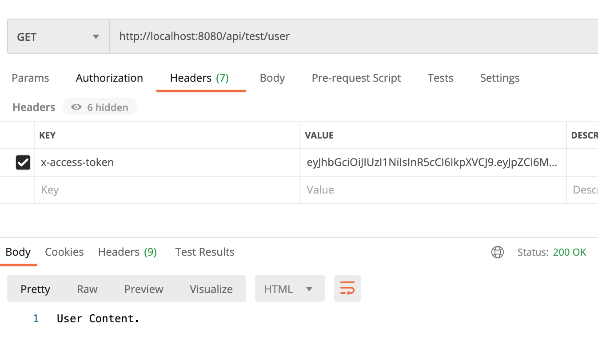
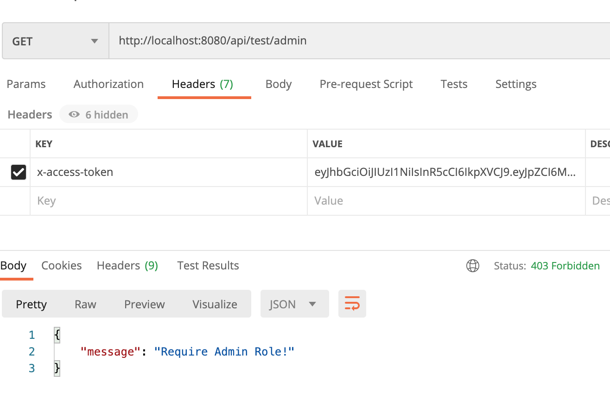

# Documentation
 APIs that we need to provide:
```
method     url                  action
POST	     ||/api/auth/signup	 ||signup new account
POST	     ||/api/auth/signin	 ||login an account
GET	     ||/api/test/all	 ||retrieve public content
GET	     ||/api/test/user	 ||access User’s content
GET	     ||/api/test/admin	 ||access Admin’s content
```

## project testing
>signup / create  user

>test jwt

>access-token  

>test user 

>test role user


## Project setup
```
npm install
```

Then, edit `app/config/db.config.js` with correct DB credentials.

### Run
```
node server.js
```
